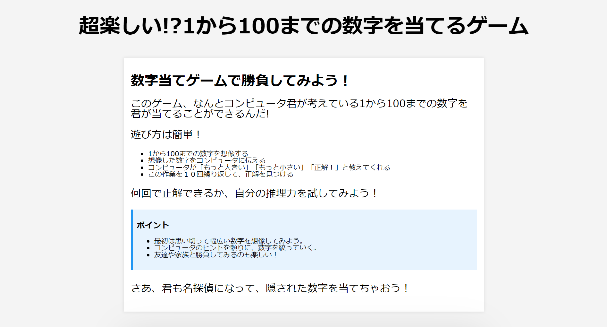

# 数当てゲーム

## サービスの概要

コンピュータが生成した数を当てるゲームである。

## このアプリを作ったきっかけ

自分たちの学科で習っている技術で、ゲームを含めたウェブアプリを作ることができることを知ってくて作りました。加えて、自分がこのゲームをして楽しかったのは言うまでもない。

## 使用している技術

 

## ページの説明

| 説明欄                                     | 入力欄                                                               |
| ------------------------------------------ | -------------------------------------------------------------------- |
|                |                                        |
| ここでは、数当てゲームの説明をしています。 | ここでは、ユーザーがコンピュータの数を当てる入力欄を用意しています。 |
